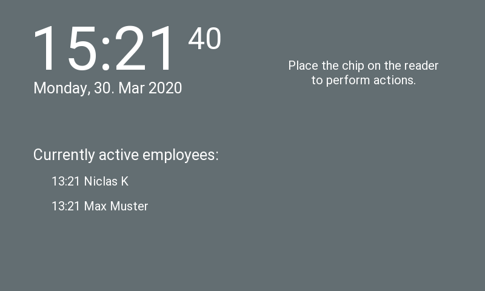

# rpi-timeclock-terminal
This is a python timeclock application running on a Raspberry Pi Zero W with attached touch screen
and RFID reader. It allows your employees to clock in/out and to see a summary of their worked 
hours and vacation. This project uses [bizley/timeclock](github.com/bizley/timeclock) as backend. 
Instructions on how to print the case and connect the hardware are in the ```hardware/``` folder.
 
## Operating System
Tested under [Raspbian](https://www.raspberrypi.org/downloads/raspbian/) Buster Lite February 2020.

## Dependencies
Update the system. 
```
sudo apt update
sudo apt dist-upgrade
```

Install dependencies and kivy.
```
sudo apt install libsdl2-dev libsdl2-image-dev libsdl2-mixer-dev libsdl2-ttf-dev \
   pkg-config libgl1-mesa-dev libgles2-mesa-dev \
   python-setuptools libgstreamer1.0-dev git-core \
   gstreamer1.0-plugins-{bad,base,good,ugly} \
   gstreamer1.0-{omx,alsa} python3-dev libmtdev-dev \
   xclip xsel libjpeg-dev python3-pip
sudo pip3 install Cython==0.29.10 pillow kivy pygments spidev pi-rc522 RPi.GPIO
```

## Configuration
Set locale and timezone.
```
sudo raspi-config
```

Modify ```/boot/config.txt``` to support touchscreen and RFID reader.
```
hdmi_group=2
hdmi_mode=87
hdmi_cvt 800 480 60 6 0 0 0
hdmi_drive=1
hdmi_force_hotplug=1
display_rotate=2
dtparam=i2c_arm=on
dtparam=spi=on
dtoverlay=ads7846,penirq=25,speed=10000,keep_vref_on=0,penirq_pull=2,xohms=150
dtoverlay=spi1-1cs
```

Modify kivy ```~/.kivy/config.ini``` to invert touchscreen x-axis (file is created during 
import of kivy).
```
[input]
mouse = mouse
%(name)s = probesysfs,provider=hidinput,param=invert_x=1
```

## Usage
Configuration is stored in ```config.py```. Currently supported languages: 'de', 'en'.
```
"""
Timeclock server address
"""
hostname = 'localhost'
port = '8000'

"""
Authorization of the timeclock's server special terminal user
"""
terminal_id = '4'
api_key = 'tRu4Y316ypP6Kfce4L4c'

"""
Locale has to be installed on the system
Languages currently supported: de, en
"""
locale = 'en_US.utf8'
lang = 'en'

"""
RFID device
/dev/spidevbus.device
e.g.: /dev/spidev1.0
irq = GPIO connected to interrupt pin RC522
rst = GPIO connected to reset pin RC522
"""
bus = 1
device = 0
irq = 36
rst = 37
```

The application downloads all user data from timeclock server automatically (pictures: only 283x420px tested).

Start application.
```
python3 terminal.py
```

## Autostart with systemd
Save to ```/etc/systemd/system/rpi-timeclock-terminal.service```:
```
[Unit]
Description=rpi-timeclock-terminal
After=network.target

[Service]
ExecStart=/usr/bin/python3 -u terminal.py
WorkingDirectory=/home/pi/rpi-timeclock-terminal
StandardOutput=inherit
StandardError=inherit
Restart=always
User=pi

[Install]
WantedBy=multi-user.target
```

Enable and start the service:
```
sudo systemctl enable rpi-timeclock-terminal.service
sudo systemctl start rpi-timeclock-terminal.service
```

## Automatic WiFi Reconnect
Sometimes the WiFi connection of the Pi dropped and new connection attempts failed. In order to address this issue one 
can use a watchdog that pings a local server and restarts the Pi if the server is not reachable. Installation:
```bash
sudo apt-get install watchdog
sudo modprobe bcm2835_wdt
echo "bcm2835_wdt" | sudo tee -a /etc/modules
```

Configuration file `/etc/watchdog.conf`.
```bash
realtime		= yes
priority		= 1

interface = wlan0    # use interface wlan0
ping-count = 5       # ping 5 times
ping = 192.168.1.1   # ping test destination IP address
interval = 50        # check interval
```

## Screenshots



Photos of the hardware can be found in `hardware/` folder.

## Translations
Translations are in the ```lang/``` folder. You can use the following commands to initialize, update and
compile new translations (e.g 'de').
```
# Get translatable texts and create .pot file
xgettext -Lpython --from-code utf-8 --output=terminal.pot terminal.py terminal.kv dataprovider.py rfidprovider.py

# Initialize .po file
msginit --no-translator -o lang/de/LC_MESSAGES/terminal.po -i terminal.pot

# Update .po file
msgmerge --update --no-fuzzy-matching --backup=off lang/de/LC_MESSAGES/terminal.po terminal.pot

# Compile .po file
msgfmt -c -o lang/de/LC_MESSAGES/terminal.mo lang/de/LC_MESSAGES/terminal.po
```

## Colours
- Red 9E2416
- Green 608E47
- Orange CA5122
- Brown 9E7B53